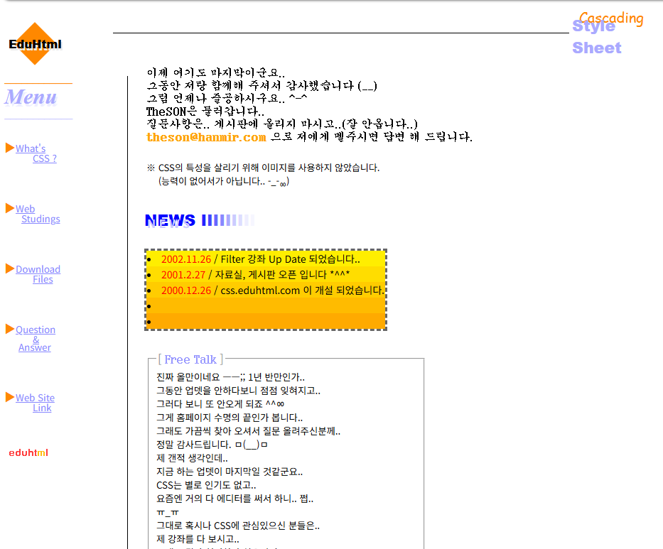
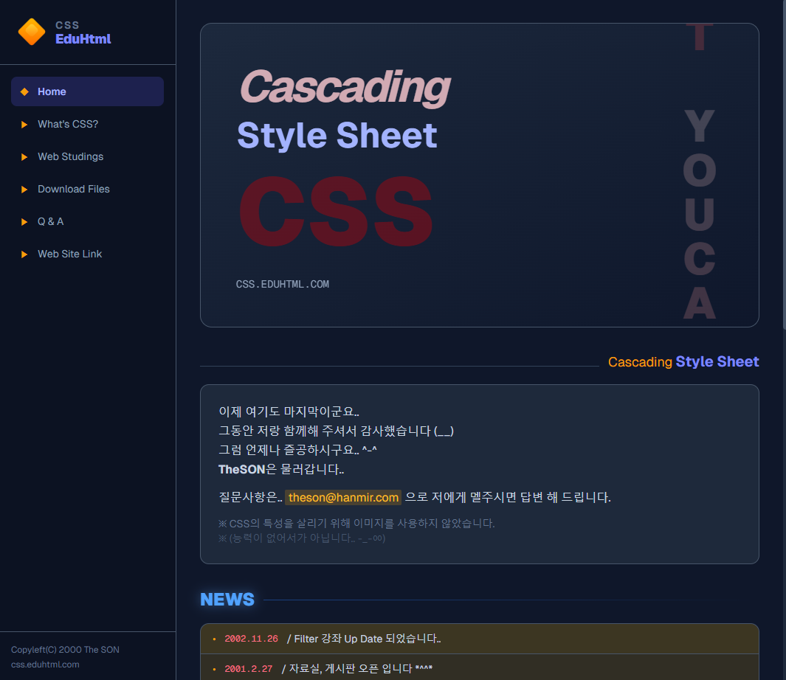

# CSS.EduHTML.com

2000년에 만든 CSS 강좌 사이트를 2026년 모던 웹 기술로 리뉴얼한 프로젝트입니다.

> **[css-eduhtml.vercel.app](https://css-eduhtml.vercel.app/)** | **[css-eduhtml.theson.workers.dev](https://css-eduhtml.theson.workers.dev/)** 에서 확인할 수 있습니다.

| As-Is (2000년) | To-Be (2026년) |
|---|---|
|  |  |
| HTML + CSS, 프레임셋, IE 전용 필터 | Next.js + TypeScript + TailwindCSS v4 |
| [Internet Archive에서 보기](https://web.archive.org/web/20030212122119/http://css.eduhtml.com/) | [배포 사이트 보기](https://css-eduhtml.vercel.app/) |

## 프로젝트 소개

2000년 고등학교 1학년 때 만들었던 CSS 강좌 사이트 **css.eduhtml.com**을 현재 모던 웹 표준에 맞추어 재구축한 프로젝트입니다. 원본 사이트는 더 이상 존재하지 않으며, Internet Archive에서 복원한 데이터를 기반으로 제작되었습니다.

본 프로젝트는 [Claude Code](https://claude.ai)를 활용한 **Vibe Coding**으로 진행되었습니다.

## 기술 스택

- **Framework**: Next.js 16 (App Router)
- **Language**: TypeScript
- **Styling**: TailwindCSS v4
- **Deployment**: Vercel, Cloudflare Pages
- **Data**: 정적 JSON/TS 기반 (DB 없음)

## 페이지 구성 (총 28개 정적 페이지)

| 경로 | 설명 |
|---|---|
| `/` | 홈 - Hero 섹션, 환영 메시지, NEWS, Free Talk |
| `/what` | What's CSS? - CSS 소개 에세이 |
| `/study` | 강좌 목록 (기초 0~4 / 중급 5~13 / 고급 14~18) |
| `/study/[00~18]` | 19개 개별 강좌 상세 페이지 |
| `/download` | 자료실 (원본 파일 미보존 안내) |
| `/qna` | Q&A 게시판 목록 (JSON 기반, 20개 게시글) |
| `/qna/[id]` | Q&A 게시글 상세 + 답글 |
| `/link` | CSS 관련 링크 모음 |

## 주요 변환 내역

### 레이아웃
- **프레임셋** → 반응형 사이드바 (데스크탑: sticky, 모바일: 햄버거 메뉴)
- **테이블 레이아웃** → Flexbox / Grid
- 모든 페이지 반응형 대응

### 시각 효과
- **텍스트 중복 그림자** → CSS `text-shadow`, `drop-shadow` 활용
- **`<marquee>` 태그** → CSS `@keyframes` 애니메이션
- **`<font color>` 남용** → `mark`, `strong`, `em` + 절제된 색상 체계
- **IE 전용 filter** → 표준 CSS 속성으로 대체

### 기능
- **Q&A 게시판**: 제로보드 → CDX API로 목록 복원 → JSON 데이터 + Next.js 동적 라우팅 (`/qna/[id]`)
- **강좌 상세**: 정적 생성(`generateStaticParams`)으로 19개 강좌 페이지 빌드
- **인터넷 아카이브 링크**: `css.eduhtml.com` 텍스트를 원본 아카이브 URL로 연결
- **히어로 "YOU CAN DO IT"**: 세로 무한 스크롤 애니메이션

### 개발 환경
- Next.js 개발 인디케이터 비활성화 (`devIndicators: false`)

## 데이터 파일

| 파일 | 설명 |
|---|---|
| `src/data/studies.ts` | 19개 강좌 메타데이터 |
| `src/data/study-content.json` | 강좌 본문 (HTML에서 정제된 텍스트) |
| `src/data/qna.ts` | Q&A 게시판 20개 게시글 |

## 문서

| 파일 | 설명 |
|---|---|
| `docs/01-design-concept.md` | 디자인 컨셉 |
| `docs/02-progress-report.md` | 진행 보고서 |
| `docs/03-design-changes.md` | 디자인 변경 기록 |

## 로컬 개발

```bash
npm install
npm run dev
```

http://localhost:3000 에서 확인할 수 있습니다.

## 프로젝트 시작 프롬프트

이 프로젝트는 아래 내용을 기반으로 시작되었습니다:

<details>
<summary>초기 프로젝트 요구사항 (클릭하여 펼치기)</summary>

### 작업개요

과거 2000년 고1때 만들었던 구형 웹사이트를 현재 2026년 모던 스타일에 맞추어 새로 웹사이트를 만든다.

인터넷 아카이브 주소
https://web.archive.org/web/20030212122119/http://css.eduhtml.com/

### 주요 요구사항

- next.js 기반으로 만들 것.
- 주요 언어는 typescript 로 할 것.
- css 는 tailwindcss 로 적용할 것.
  - 텍스트에 그림자를 두기 위해 중복으로 쓴 텍스트가 있다. 이것은 tailwindcss 의 shadow 기능으로 대신 반영한다.
  - 설명 텍스트에 지나치게 다양한 색상과 decoration 을 쓰고 있는데, 이건 mark 와 strong, em 과 같은 절제된 강조로 바꾸고 적절히 색깔을 넣어줄 것.
  - 과거 IE 전용 marquee 태그가 쓰였는데, 이건 div 로 바꾸고 가로 스크롤 애니메이션을 적용한다.
- 반응형 사이트로 만들 것.
- 이미지는 images 폴더에 두어서 참조할 것.
- 구형 사이트라 frame 및 frameset 이 사용되고 있는데 이 부분을 일반적인 사이드 네비게이션으로 만들것.
  - 사이드 네비게이션은 모바일 모드(반응형)가 되면 좌측 상단에 햄버거 메뉴(가로줄 세개)가 보여지되 그걸 누르면 사이드 네비게이션이 보이도록 만들것.
- 질문과 답변(Question & Answer)은 게시판 내용인데, 게시판 CRUD를 구현하지는 않을 것이다.
  - 그래서 관련 내용을 수집하여 json 으로 변환후 이 내용을 게시판에 출력한다.
  - 아마 상기 아카이브 주소로는 404 오류 뜨며 게시판 접근이 불가하기에, 해당 내용은 다음 아카이브 링크를 대신한다.
  - https://web.archive.org/web/20050205231638/http://css.eduhtml.com/css.htm

### 추가 요구사항

프로젝트 진행 상황에 대해 문서화를 해야한다.

문서는 프로젝트 루트 폴더 내 docs 에 markdown 문서로 둔다.

만약 이미지 같은 첨부 파일이 필요하다면 markdown/files 에 관련 파일을 두고 마크다운 문서에 기록한다.

#### 프로젝트 진행 사항 기록

각 작업 단계별로 요약된 문서를 만들어둔다.

어떻게 진행하고 어떻게 결과가 만들어졌는지 보고서를 작성한다.

#### 디자인 변경

모던 스타일에 맞게 디자인을 변경하되 변경할 디자인에 대한 이미지를 컨셉아트처럼 만들어서 이 역시 문서화한다.

만들어진 디자인 문서를 바탕으로 웹사이트에 디자인을 입힌다.

</details>
